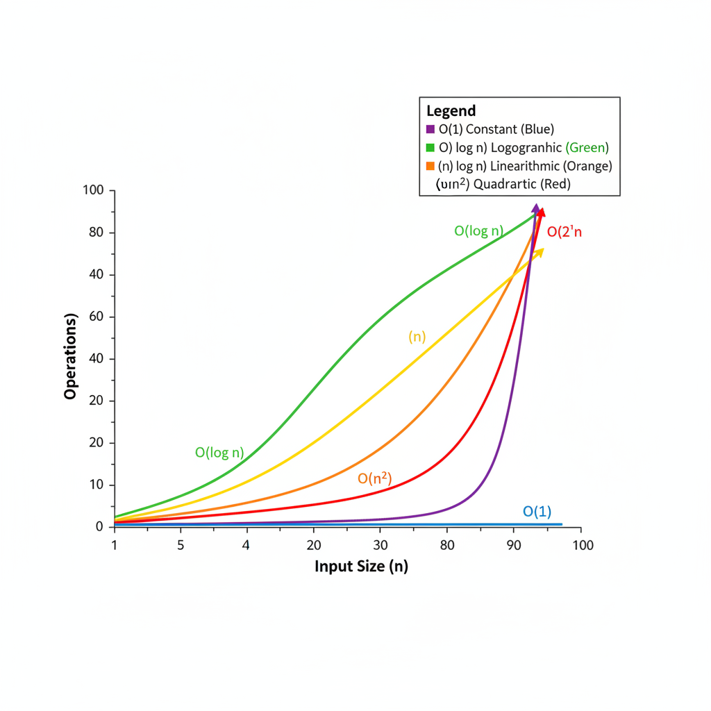
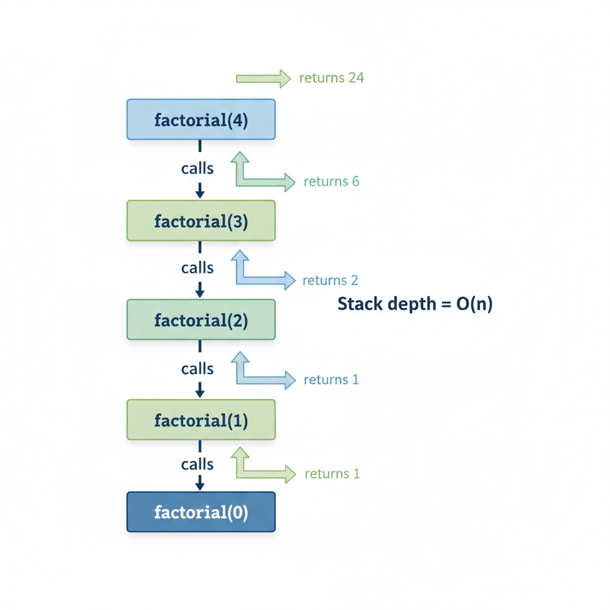
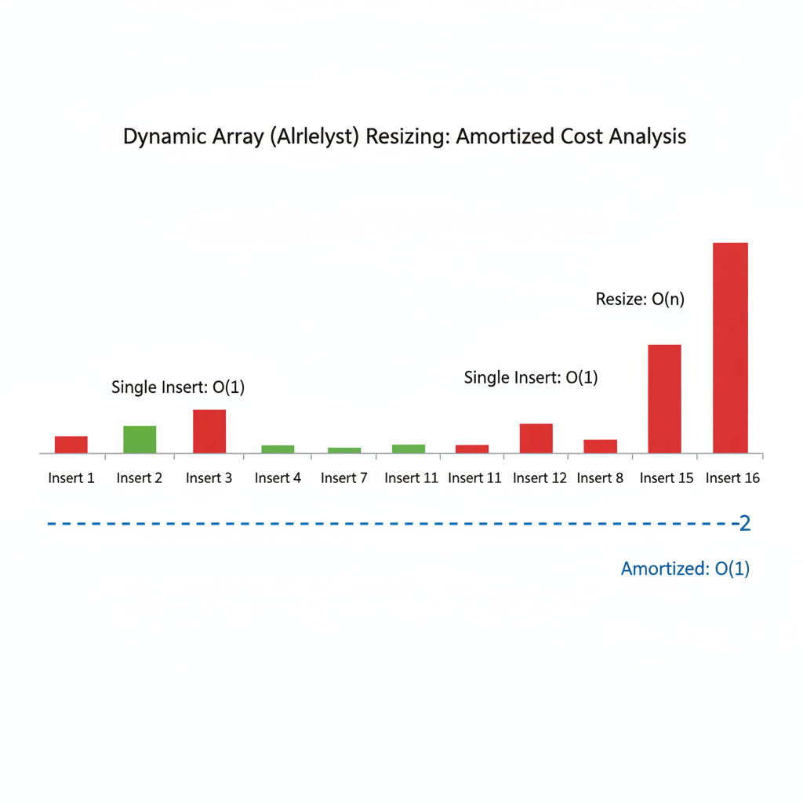
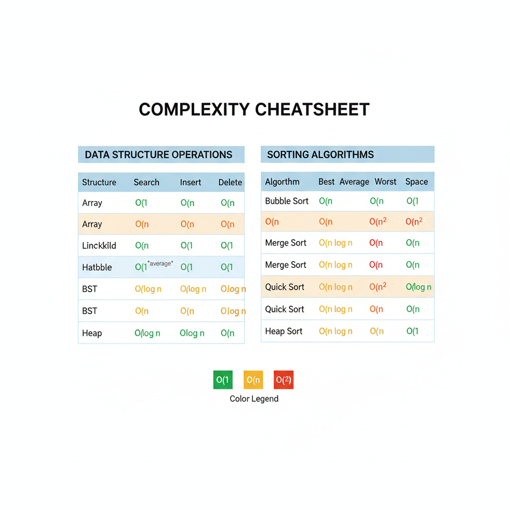

# Complexity Analysis Deep Dive

Mastering complexity analysis is the foundation of coding interviews. At senior+ levels, you're expected to analyze time and space complexity accurately, discuss tradeoffs, and understand nuanced concepts like amortized analysis.



---

## Big O Notation: Beyond the Basics

Big O describes the **upper bound** of an algorithm's growth rate. But interviewers expect you to know more than just definitions.

### The Common Complexities

| Complexity | Name | Example |
|------------|------|---------|
| O(1) | Constant | Array index access, hash table lookup |
| O(log n) | Logarithmic | Binary search, balanced BST operations |
| O(n) | Linear | Single loop through array |
| O(n log n) | Linearithmic | Merge sort, heap sort, efficient sorting |
| O(n²) | Quadratic | Nested loops, bubble sort |
| O(n³) | Cubic | Triple nested loops, naive matrix multiplication |
| O(2ⁿ) | Exponential | Recursive subsets, naive Fibonacci |
| O(n!) | Factorial | Generating all permutations |

### Key Insight: Growth Rate Matters

At n = 1000:
- O(log n) ≈ 10 operations
- O(n) = 1,000 operations
- O(n log n) ≈ 10,000 operations
- O(n²) = 1,000,000 operations
- O(2ⁿ) = more atoms than in the universe

**Interview tip**: When asked "can we do better?", mentally walk through this hierarchy. If you're at O(n²), ask: "Is O(n log n) possible? Is O(n) possible?"

---

## Analyzing Time Complexity

### The Rules

1. **Drop constants**: O(2n) = O(n)
2. **Drop lower-order terms**: O(n² + n) = O(n²)
3. **Multiply nested operations**: Loop inside loop = O(outer × inner)
4. **Add sequential operations**: Loop then loop = O(n + m)

### Common Patterns

**Single loop**: O(n)
```python
for i in range(n):
    # O(1) work
```

**Nested loops (same bound)**: O(n²)
```python
for i in range(n):
    for j in range(n):
        # O(1) work
```

**Nested loops (different bounds)**: O(n × m)
```python
for i in range(n):
    for j in range(m):
        # O(1) work
```

**Loop with halving**: O(log n)
```python
while n > 0:
    n = n // 2
```

**Loop calling O(n) function**: O(n²)
```python
for i in range(n):
    some_list.index(target)  # O(n) each call!
```

### Tricky Cases

**String concatenation in loop**:
```python
result = ""
for char in s:
    result += char  # Creates new string each time!
```
Time complexity: O(n²) because string concatenation is O(n)

**Better approach**:
```python
result = "".join(s)  # O(n)
```

**List operations matter**:
```python
# O(1) - append to end
my_list.append(x)

# O(n) - insert at beginning (shifts all elements)
my_list.insert(0, x)

# O(n) - remove by value (searches then shifts)
my_list.remove(x)

# O(1) - remove from end
my_list.pop()

# O(n) - remove from beginning
my_list.pop(0)
```

---

## Space Complexity

Space complexity measures additional memory used by your algorithm (excluding input).

### Common Patterns

**O(1) space**: Fixed number of variables
```python
def sum_array(arr):
    total = 0  # Just one variable
    for num in arr:
        total += num
    return total
```

**O(n) space**: Data structure proportional to input
```python
def reverse_array(arr):
    result = []  # Grows with input
    for num in reversed(arr):
        result.append(num)
    return result
```

**O(n) space from recursion**: Call stack depth
```python
def factorial(n):
    if n <= 1:
        return 1
    return n * factorial(n - 1)  # n recursive calls = O(n) stack space
```

### The Recursive Call Stack



Each recursive call adds a frame to the call stack. Consider:

```python
def fibonacci(n):
    if n <= 1:
        return n
    return fibonacci(n-1) + fibonacci(n-2)
```

- **Time**: O(2ⁿ) - exponential due to overlapping subproblems
- **Space**: O(n) - maximum stack depth is n (deepest path)

**Interview tip**: Many candidates say O(2ⁿ) space for naive Fibonacci. The space is O(n) because once a branch completes, its stack frames are reclaimed.

---

## Amortized Analysis

Amortized analysis averages the cost over a sequence of operations. It's crucial for understanding dynamic arrays and hash tables.



### Dynamic Array (ArrayList) Resizing

When a dynamic array runs out of capacity, it doubles in size and copies all elements.

| Operation | Individual Cost | Amortized Cost |
|-----------|-----------------|----------------|
| append (normal) | O(1) | O(1) |
| append (resize) | O(n) | - |
| n appends | - | O(1) per append |

**Why O(1) amortized?**

If we start with capacity 1 and double each time:
- Insert 1: cost 1 (capacity now 1)
- Insert 2: cost 1 + 1 copy = 2 (capacity now 2)
- Insert 3: cost 1 + 2 copies = 3 (capacity now 4)
- Insert 4: cost 1 (capacity still 4)
- Insert 5: cost 1 + 4 copies = 5 (capacity now 8)

Total cost for n inserts: n + (1 + 2 + 4 + 8 + ... + n/2) ≈ n + n = 2n

Average per insert: 2n / n = O(1)

### Hash Table Operations

Average case: O(1) for insert, delete, lookup
Worst case: O(n) if all keys hash to same bucket

**With good hash function and load factor < 0.75**: O(1) amortized

**Interview tip**: When discussing hash tables, mention:
1. Average case is O(1)
2. Worst case is O(n)
3. Amortized O(1) with proper load factor management

---

## Master Theorem

For divide-and-conquer recurrences of the form:

**T(n) = aT(n/b) + O(nᵈ)**

Where:
- a = number of subproblems
- b = factor by which input size shrinks
- d = exponent of work done at each level

### The Three Cases

| Condition | Result | Intuition |
|-----------|--------|-----------|
| d > log_b(a) | O(nᵈ) | Work dominates |
| d = log_b(a) | O(nᵈ log n) | Balanced |
| d < log_b(a) | O(n^(log_b(a))) | Subproblems dominate |

### Examples

**Merge Sort**: T(n) = 2T(n/2) + O(n)
- a = 2, b = 2, d = 1
- log_2(2) = 1 = d
- Result: O(n log n) ✓

**Binary Search**: T(n) = T(n/2) + O(1)
- a = 1, b = 2, d = 0
- log_2(1) = 0 = d
- Result: O(log n) ✓

**Naive Matrix Multiply**: T(n) = 8T(n/2) + O(n²)
- a = 8, b = 2, d = 2
- log_2(8) = 3 > d
- Result: O(n³) (subproblems dominate)

**Strassen's Algorithm**: T(n) = 7T(n/2) + O(n²)
- a = 7, b = 2, d = 2
- log_2(7) ≈ 2.81 > d
- Result: O(n^2.81) ✓

---

## Best, Average, and Worst Case

Always clarify which case you're analyzing.

### Quick Sort Example

```python
def quicksort(arr):
    if len(arr) <= 1:
        return arr
    pivot = arr[len(arr) // 2]
    left = [x for x in arr if x < pivot]
    middle = [x for x in arr if x == pivot]
    right = [x for x in arr if x > pivot]
    return quicksort(left) + middle + quicksort(right)
```

| Case | Condition | Time | Space |
|------|-----------|------|-------|
| Best | Balanced partitions | O(n log n) | O(log n) |
| Average | Random data | O(n log n) | O(log n) |
| Worst | Already sorted, bad pivot | O(n²) | O(n) |

**Interview tip**: When asked about quicksort complexity, say "O(n log n) average case, O(n²) worst case if we pick a bad pivot like always choosing the first element on sorted data."

---

## Space-Time Tradeoffs

Often you can trade space for time or vice versa. This is a favorite interview discussion topic.

### Two Sum Example

**O(n²) time, O(1) space** - Brute force:
```python
def two_sum(nums, target):
    for i in range(len(nums)):
        for j in range(i + 1, len(nums)):
            if nums[i] + nums[j] == target:
                return [i, j]
```

**O(n) time, O(n) space** - Hash map:
```python
def two_sum(nums, target):
    seen = {}
    for i, num in enumerate(nums):
        complement = target - num
        if complement in seen:
            return [seen[complement], i]
        seen[num] = i
```

**Interview tip**: Always acknowledge the tradeoff. "I'm using O(n) extra space to achieve O(n) time instead of O(n²)."

---

## Common Interview Questions About Complexity

### "What's the complexity of X?"

Be precise:
- "O(n) where n is the length of the input array"
- "O(V + E) where V is vertices and E is edges"
- "O(n log n) for the sorting step, plus O(n) for the linear scan, so O(n log n) overall"

### "Can we do better?"

Think systematically:
1. What's the lower bound? (e.g., must look at all elements → at least O(n))
2. What data structure might help? (hash map → O(1) lookup)
3. Is there a pattern we can exploit? (sorted → binary search)

### "What's the space complexity of your recursive solution?"

Remember:
- Stack depth = maximum recursion depth
- Each frame stores local variables
- Tail recursion can be O(1) space in some languages (not Python)

---

## Complexity Cheatsheet



### Data Structure Operations

| Structure | Access | Search | Insert | Delete |
|-----------|--------|--------|--------|--------|
| Array | O(1) | O(n) | O(n) | O(n) |
| Dynamic Array | O(1) | O(n) | O(1)* | O(n) |
| Linked List | O(n) | O(n) | O(1)** | O(1)** |
| Hash Table | - | O(1)* | O(1)* | O(1)* |
| BST | O(log n)* | O(log n)* | O(log n)* | O(log n)* |
| Heap | O(1)*** | O(n) | O(log n) | O(log n) |

\* Amortized or average case
\** If you have reference to the node
\*** Min/max only

### Sorting Algorithms

| Algorithm | Best | Average | Worst | Space | Stable |
|-----------|------|---------|-------|-------|--------|
| Bubble Sort | O(n) | O(n²) | O(n²) | O(1) | Yes |
| Selection Sort | O(n²) | O(n²) | O(n²) | O(1) | No |
| Insertion Sort | O(n) | O(n²) | O(n²) | O(1) | Yes |
| Merge Sort | O(n log n) | O(n log n) | O(n log n) | O(n) | Yes |
| Quick Sort | O(n log n) | O(n log n) | O(n²) | O(log n) | No |
| Heap Sort | O(n log n) | O(n log n) | O(n log n) | O(1) | No |
| Counting Sort | O(n + k) | O(n + k) | O(n + k) | O(k) | Yes |
| Radix Sort | O(nk) | O(nk) | O(nk) | O(n + k) | Yes |

---

## Practice Problems

Test your complexity analysis skills:

1. What's the time complexity of checking if a string is a palindrome?
2. What's the space complexity of BFS on a graph with V vertices and E edges?
3. If an algorithm makes O(log n) recursive calls, each doing O(n) work, what's the total time?
4. What's the amortized time complexity of n push operations on a stack implemented with a dynamic array?

---

## Key Takeaways for Interviews

1. **Always state your complexity clearly** - "This is O(n) time and O(1) space"
2. **Explain the 'n'** - "where n is the length of the input array"
3. **Mention tradeoffs** - "We could use O(1) space with O(n²) time, but I'm using O(n) space for O(n) time"
4. **Know amortized analysis** - Especially for dynamic arrays and hash tables
5. **Consider all cases** - Best, average, worst; mention which you're analyzing
