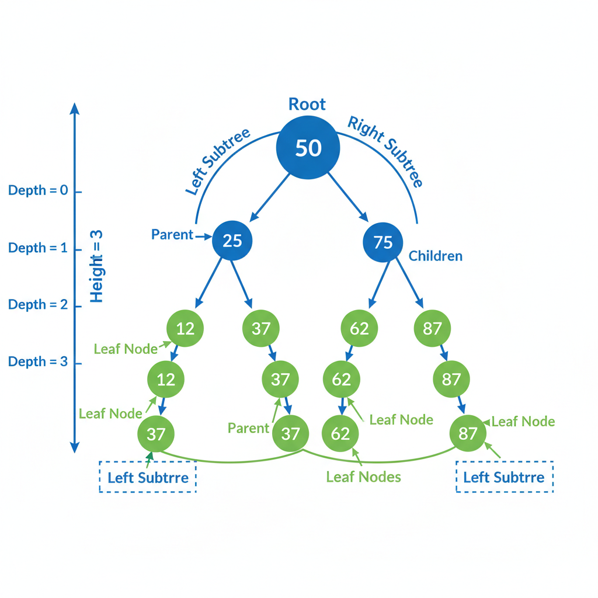
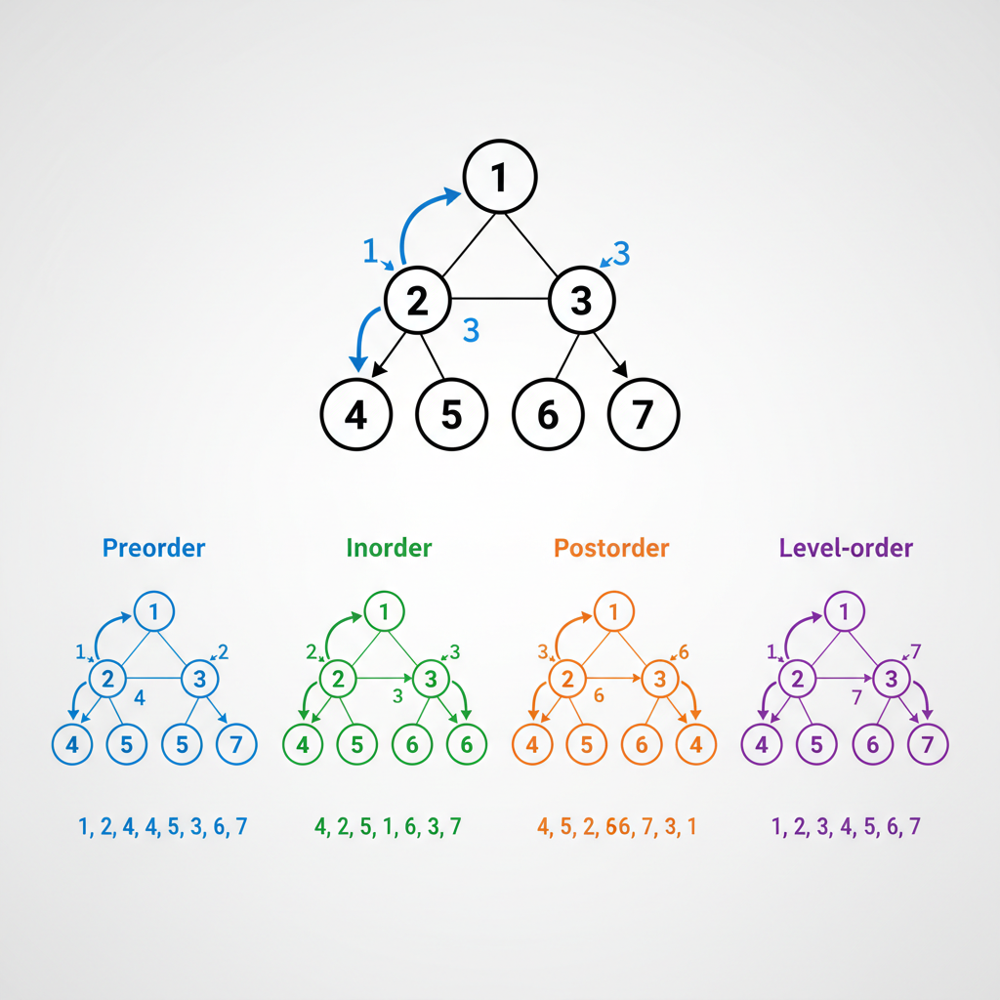
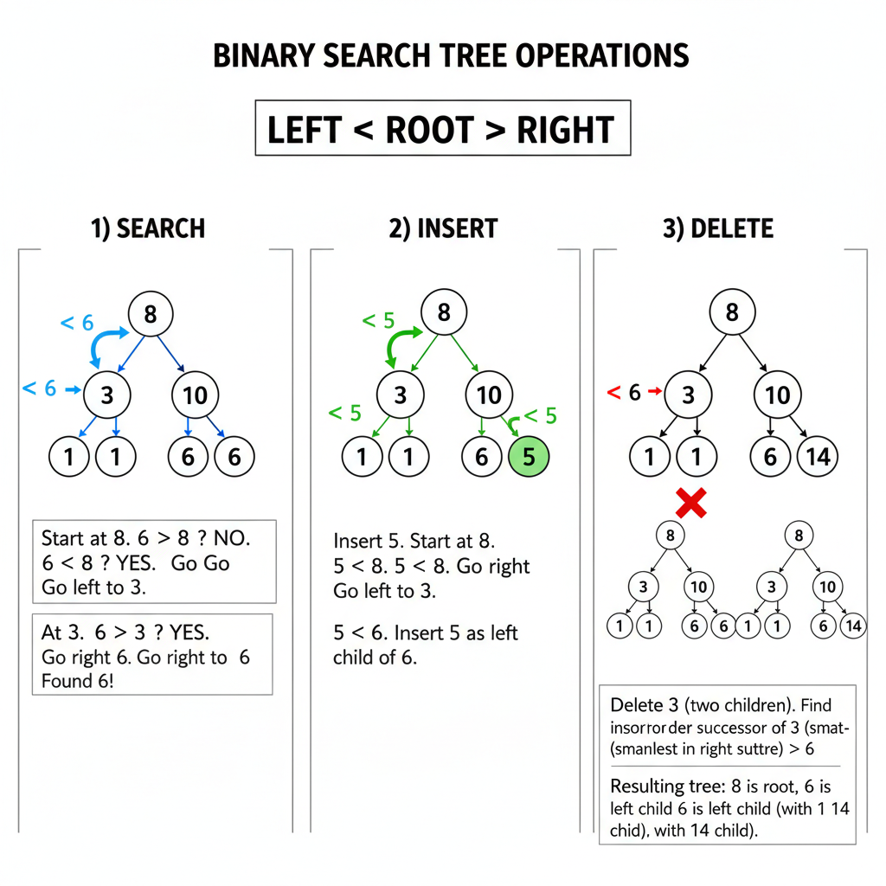

# Trees and Binary Search Trees

Trees are one of the most frequently tested topics in coding interviews. You must master traversals, BST properties, and recursive thinking.



---

## Tree Basics

### Terminology

- **Node**: Contains data and references to children
- **Root**: Top node (no parent)
- **Leaf**: Node with no children
- **Height**: Longest path from node to leaf
- **Depth**: Distance from root to node
- **Level**: All nodes at same depth

### Tree Node Definition

```python
class TreeNode:
    def __init__(self, val=0, left=None, right=None):
        self.val = val
        self.left = left
        self.right = right
```

---

## Tree Traversals

Four essential traversals - know them by heart.



### Preorder (Root → Left → Right)

Process node before children. Used for: copying trees, prefix expressions.

```python
def preorder(root):
    if not root:
        return []
    return [root.val] + preorder(root.left) + preorder(root.right)

# Iterative
def preorder_iterative(root):
    if not root:
        return []
    result, stack = [], [root]
    while stack:
        node = stack.pop()
        result.append(node.val)
        if node.right:  # Right first so left is processed first
            stack.append(node.right)
        if node.left:
            stack.append(node.left)
    return result
```

### Inorder (Left → Root → Right)

Process left, then node, then right. **BST inorder gives sorted order.**

```python
def inorder(root):
    if not root:
        return []
    return inorder(root.left) + [root.val] + inorder(root.right)

# Iterative
def inorder_iterative(root):
    result, stack = [], []
    current = root
    while current or stack:
        while current:
            stack.append(current)
            current = current.left
        current = stack.pop()
        result.append(current.val)
        current = current.right
    return result
```

### Postorder (Left → Right → Root)

Process children before node. Used for: deleting trees, postfix expressions.

```python
def postorder(root):
    if not root:
        return []
    return postorder(root.left) + postorder(root.right) + [root.val]

# Iterative (trickier)
def postorder_iterative(root):
    if not root:
        return []
    result, stack = [], [root]
    while stack:
        node = stack.pop()
        result.append(node.val)
        if node.left:
            stack.append(node.left)
        if node.right:
            stack.append(node.right)
    return result[::-1]  # Reverse at end
```

### Level Order (BFS)

Process level by level. Used for: shortest path, level averages.

```python
from collections import deque

def level_order(root):
    if not root:
        return []
    result = []
    queue = deque([root])
    while queue:
        level = []
        for _ in range(len(queue)):
            node = queue.popleft()
            level.append(node.val)
            if node.left:
                queue.append(node.left)
            if node.right:
                queue.append(node.right)
        result.append(level)
    return result
```

---

## Binary Search Tree (BST)

### BST Property

For every node:
- All values in left subtree < node value
- All values in right subtree > node value

This property enables O(log n) search, insert, delete.



### BST Search

```python
def search(root, val):
    if not root or root.val == val:
        return root
    if val < root.val:
        return search(root.left, val)
    return search(root.right, val)
```

**Time**: O(h) where h = height. O(log n) balanced, O(n) worst case.

### BST Insert

```python
def insert(root, val):
    if not root:
        return TreeNode(val)
    if val < root.val:
        root.left = insert(root.left, val)
    else:
        root.right = insert(root.right, val)
    return root
```

### BST Delete

Three cases:
1. **Leaf**: Simply remove
2. **One child**: Replace with child
3. **Two children**: Replace with inorder successor (or predecessor)

```python
def delete(root, val):
    if not root:
        return None

    if val < root.val:
        root.left = delete(root.left, val)
    elif val > root.val:
        root.right = delete(root.right, val)
    else:
        # Found the node to delete
        if not root.left:
            return root.right
        if not root.right:
            return root.left

        # Two children: find inorder successor
        successor = root.right
        while successor.left:
            successor = successor.left
        root.val = successor.val
        root.right = delete(root.right, successor.val)

    return root
```

### Validate BST

```python
def is_valid_bst(root, min_val=float('-inf'), max_val=float('inf')):
    if not root:
        return True
    if root.val <= min_val or root.val >= max_val:
        return False
    return (is_valid_bst(root.left, min_val, root.val) and
            is_valid_bst(root.right, root.val, max_val))
```

**Interview tip**: Don't just check `left.val < root.val < right.val`. The entire left subtree must be less than root.

---

## Common Tree Problems

### Maximum Depth

```python
def max_depth(root):
    if not root:
        return 0
    return 1 + max(max_depth(root.left), max_depth(root.right))
```

### Minimum Depth

```python
def min_depth(root):
    if not root:
        return 0
    if not root.left:
        return 1 + min_depth(root.right)
    if not root.right:
        return 1 + min_depth(root.left)
    return 1 + min(min_depth(root.left), min_depth(root.right))
```

### Same Tree

```python
def is_same_tree(p, q):
    if not p and not q:
        return True
    if not p or not q:
        return False
    return (p.val == q.val and
            is_same_tree(p.left, q.left) and
            is_same_tree(p.right, q.right))
```

### Symmetric Tree

```python
def is_symmetric(root):
    def is_mirror(t1, t2):
        if not t1 and not t2:
            return True
        if not t1 or not t2:
            return False
        return (t1.val == t2.val and
                is_mirror(t1.left, t2.right) and
                is_mirror(t1.right, t2.left))

    return is_mirror(root, root)
```

### Invert Binary Tree

```python
def invert_tree(root):
    if not root:
        return None
    root.left, root.right = invert_tree(root.right), invert_tree(root.left)
    return root
```

### Path Sum

```python
def has_path_sum(root, target_sum):
    if not root:
        return False
    if not root.left and not root.right:  # Leaf
        return root.val == target_sum
    return (has_path_sum(root.left, target_sum - root.val) or
            has_path_sum(root.right, target_sum - root.val))
```

---

## Lowest Common Ancestor (LCA)

### LCA in Binary Tree

```python
def lowest_common_ancestor(root, p, q):
    if not root or root == p or root == q:
        return root

    left = lowest_common_ancestor(root.left, p, q)
    right = lowest_common_ancestor(root.right, p, q)

    if left and right:
        return root  # p and q are in different subtrees
    return left or right
```

### LCA in BST (More Efficient)

```python
def lowest_common_ancestor_bst(root, p, q):
    while root:
        if p.val < root.val and q.val < root.val:
            root = root.left
        elif p.val > root.val and q.val > root.val:
            root = root.right
        else:
            return root
    return None
```

---

## Tree Construction

### From Preorder and Inorder

```python
def build_tree(preorder, inorder):
    if not preorder or not inorder:
        return None

    root_val = preorder[0]
    root = TreeNode(root_val)
    mid = inorder.index(root_val)

    root.left = build_tree(preorder[1:mid+1], inorder[:mid])
    root.right = build_tree(preorder[mid+1:], inorder[mid+1:])

    return root
```

**Optimization**: Use hashmap for O(1) index lookup instead of O(n).

### From Inorder and Postorder

```python
def build_tree(inorder, postorder):
    if not inorder or not postorder:
        return None

    root_val = postorder[-1]
    root = TreeNode(root_val)
    mid = inorder.index(root_val)

    root.left = build_tree(inorder[:mid], postorder[:mid])
    root.right = build_tree(inorder[mid+1:], postorder[mid:-1])

    return root
```

---

## Serialization and Deserialization

```python
class Codec:
    def serialize(self, root):
        if not root:
            return "null"
        return f"{root.val},{self.serialize(root.left)},{self.serialize(root.right)}"

    def deserialize(self, data):
        def helper(nodes):
            val = next(nodes)
            if val == "null":
                return None
            node = TreeNode(int(val))
            node.left = helper(nodes)
            node.right = helper(nodes)
            return node

        return helper(iter(data.split(",")))
```

---

## BST Iterator

Implement next() in O(1) average time, O(h) space.

```python
class BSTIterator:
    def __init__(self, root):
        self.stack = []
        self._push_left(root)

    def _push_left(self, node):
        while node:
            self.stack.append(node)
            node = node.left

    def next(self):
        node = self.stack.pop()
        self._push_left(node.right)
        return node.val

    def has_next(self):
        return len(self.stack) > 0
```

---

## Balanced Trees Overview

### AVL Trees
- Height difference between children ≤ 1
- O(log n) guaranteed for all operations
- Rotations to maintain balance

### Red-Black Trees
- Nodes colored red or black
- No two consecutive red nodes
- O(log n) operations
- Used in most standard libraries (TreeMap, TreeSet)

**Interview tip**: You won't implement these, but know the concepts and complexities.

---

## Time Complexities Summary

| Operation | BST Average | BST Worst | Balanced |
|-----------|-------------|-----------|----------|
| Search | O(log n) | O(n) | O(log n) |
| Insert | O(log n) | O(n) | O(log n) |
| Delete | O(log n) | O(n) | O(log n) |
| Find min/max | O(log n) | O(n) | O(log n) |

**Space**: All traversals use O(h) space for recursion stack.

---

## Practice Problems (LeetCode)

| Problem | Difficulty | Key Concept |
|---------|------------|-------------|
| 94. Binary Tree Inorder | Easy | Traversal |
| 104. Maximum Depth | Easy | Recursion |
| 101. Symmetric Tree | Easy | Mirror comparison |
| 226. Invert Binary Tree | Easy | Recursion |
| 98. Validate BST | Medium | Range validation |
| 102. Level Order Traversal | Medium | BFS |
| 236. LCA Binary Tree | Medium | Recursion |
| 105. Construct from Preorder/Inorder | Medium | Construction |
| 230. Kth Smallest in BST | Medium | Inorder |
| 297. Serialize/Deserialize | Hard | DFS/BFS |

---

## Key Takeaways

1. **Master all four traversals** - Know both recursive and iterative
2. **BST inorder = sorted** - Use this property frequently
3. **Think recursively** - Most tree problems have elegant recursive solutions
4. **Track ranges in BST** - For validation and search
5. **Consider iterative for space** - When stack space is a concern
