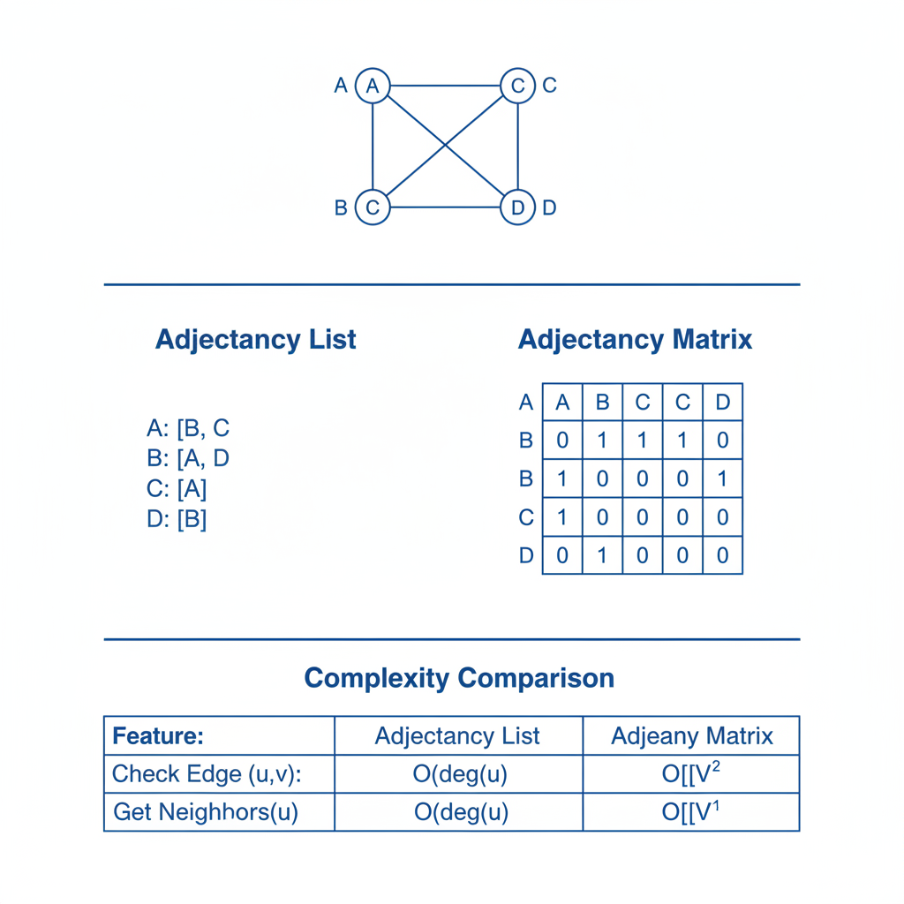
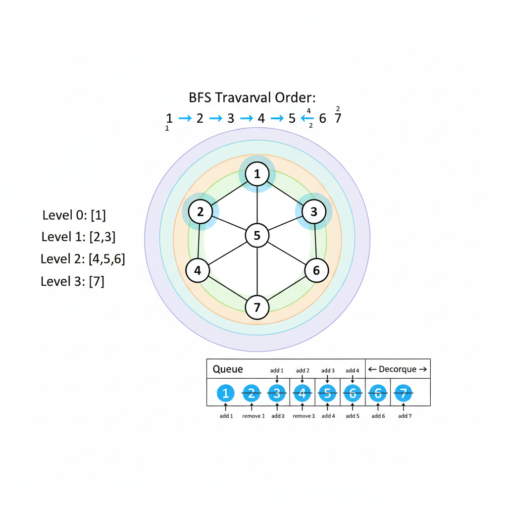
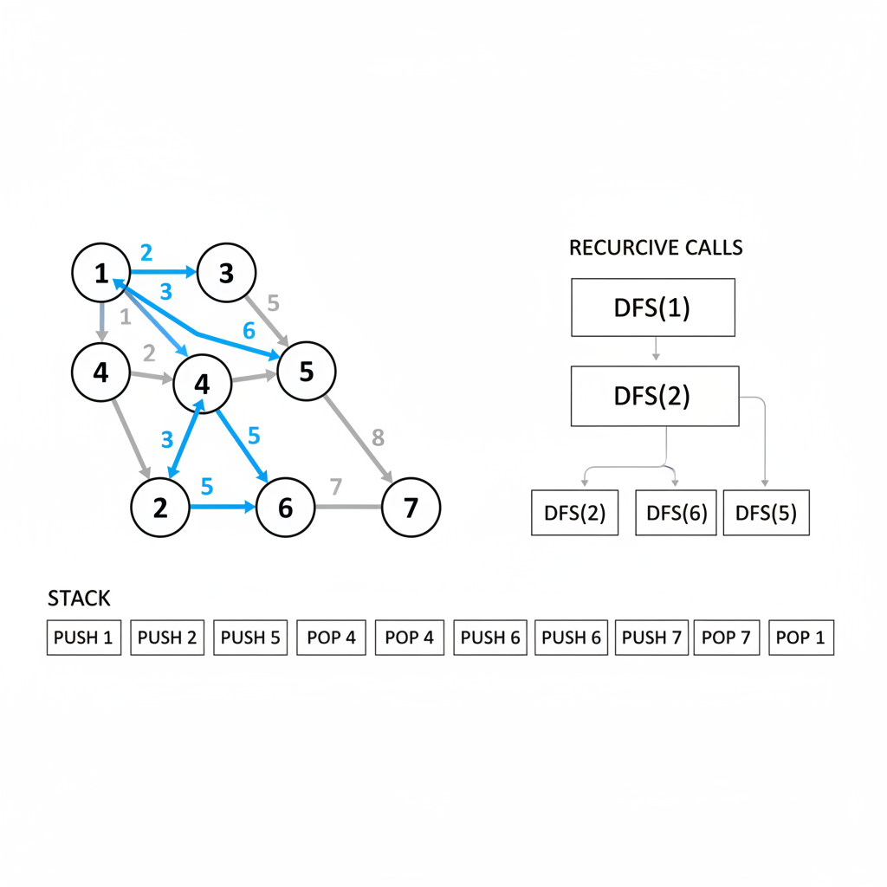

# Graphs: Fundamentals and Traversals

Graphs are everywhere in coding interviews. From social networks to maps to dependency resolution, graph problems test your ability to model real-world scenarios.



---

## Graph Basics

### Terminology

- **Vertex (Node)**: A point in the graph
- **Edge**: Connection between two vertices
- **Directed graph**: Edges have direction (A → B)
- **Undirected graph**: Edges are bidirectional (A — B)
- **Weighted graph**: Edges have associated costs
- **Path**: Sequence of vertices connected by edges
- **Cycle**: Path that starts and ends at same vertex
- **Connected**: Path exists between every pair of vertices
- **DAG**: Directed Acyclic Graph (no cycles)

---

## Graph Representations

### Adjacency List

Best for sparse graphs (few edges). O(V + E) space.

```python
# Using dictionary of lists
graph = {
    'A': ['B', 'C'],
    'B': ['A', 'D'],
    'C': ['A', 'D'],
    'D': ['B', 'C']
}

# Using defaultdict
from collections import defaultdict
graph = defaultdict(list)
graph['A'].append('B')
graph['B'].append('A')
```

### Adjacency Matrix

Best for dense graphs or when checking edge existence often. O(V²) space.

```python
# For graph with vertices 0, 1, 2, 3
# matrix[i][j] = 1 means edge from i to j
matrix = [
    [0, 1, 1, 0],
    [1, 0, 0, 1],
    [1, 0, 0, 1],
    [0, 1, 1, 0]
]
```

### When to Use Which

| Feature | Adjacency List | Adjacency Matrix |
|---------|----------------|------------------|
| Space | O(V + E) | O(V²) |
| Check edge exists | O(degree) | O(1) |
| Get all neighbors | O(degree) | O(V) |
| Add edge | O(1) | O(1) |
| Sparse graphs | ✓ Better | |
| Dense graphs | | ✓ Better |

---

## BFS (Breadth-First Search)

Visit all neighbors at current depth before going deeper. Uses a **queue**.



### BFS Template

```python
from collections import deque

def bfs(graph, start):
    visited = set([start])
    queue = deque([start])
    result = []

    while queue:
        node = queue.popleft()
        result.append(node)

        for neighbor in graph[node]:
            if neighbor not in visited:
                visited.add(neighbor)
                queue.append(neighbor)

    return result
```

### BFS with Level Tracking

```python
def bfs_levels(graph, start):
    visited = set([start])
    queue = deque([start])
    level = 0

    while queue:
        size = len(queue)
        print(f"Level {level}: ", end="")
        for _ in range(size):
            node = queue.popleft()
            print(node, end=" ")
            for neighbor in graph[node]:
                if neighbor not in visited:
                    visited.add(neighbor)
                    queue.append(neighbor)
        print()
        level += 1
```

### BFS Use Cases

- **Shortest path in unweighted graph**
- **Level-order traversal**
- **Finding connected components**
- **Check if graph is bipartite**

---

## DFS (Depth-First Search)

Go as deep as possible before backtracking. Uses **recursion** or **stack**.



### DFS Recursive

```python
def dfs(graph, node, visited=None):
    if visited is None:
        visited = set()

    visited.add(node)
    print(node)

    for neighbor in graph[node]:
        if neighbor not in visited:
            dfs(graph, neighbor, visited)

    return visited
```

### DFS Iterative

```python
def dfs_iterative(graph, start):
    visited = set()
    stack = [start]
    result = []

    while stack:
        node = stack.pop()
        if node not in visited:
            visited.add(node)
            result.append(node)
            # Add neighbors in reverse for same order as recursive
            for neighbor in reversed(graph[node]):
                if neighbor not in visited:
                    stack.append(neighbor)

    return result
```

### DFS Use Cases

- **Cycle detection**
- **Topological sort**
- **Finding strongly connected components**
- **Path finding**
- **Maze solving**

---

## Common Graph Problems

### Number of Islands (Grid BFS/DFS)

```python
def num_islands(grid):
    if not grid:
        return 0

    rows, cols = len(grid), len(grid[0])
    count = 0

    def dfs(r, c):
        if r < 0 or r >= rows or c < 0 or c >= cols or grid[r][c] == '0':
            return
        grid[r][c] = '0'  # Mark visited
        dfs(r+1, c)
        dfs(r-1, c)
        dfs(r, c+1)
        dfs(r, c-1)

    for r in range(rows):
        for c in range(cols):
            if grid[r][c] == '1':
                dfs(r, c)
                count += 1

    return count
```

### Clone Graph

```python
def clone_graph(node):
    if not node:
        return None

    cloned = {}

    def dfs(node):
        if node in cloned:
            return cloned[node]

        copy = Node(node.val)
        cloned[node] = copy

        for neighbor in node.neighbors:
            copy.neighbors.append(dfs(neighbor))

        return copy

    return dfs(node)
```

### Detect Cycle in Directed Graph

```python
def has_cycle(graph):
    # 0 = unvisited, 1 = in current path, 2 = completed
    state = {node: 0 for node in graph}

    def dfs(node):
        if state[node] == 1:  # Found cycle
            return True
        if state[node] == 2:  # Already processed
            return False

        state[node] = 1  # Mark as in current path

        for neighbor in graph[node]:
            if dfs(neighbor):
                return True

        state[node] = 2  # Mark as completed
        return False

    for node in graph:
        if dfs(node):
            return True
    return False
```

### Detect Cycle in Undirected Graph

```python
def has_cycle_undirected(graph):
    visited = set()

    def dfs(node, parent):
        visited.add(node)
        for neighbor in graph[node]:
            if neighbor not in visited:
                if dfs(neighbor, node):
                    return True
            elif neighbor != parent:  # Back edge found
                return True
        return False

    for node in graph:
        if node not in visited:
            if dfs(node, None):
                return True
    return False
```

### Shortest Path (Unweighted)

BFS naturally finds shortest path in unweighted graphs.

```python
def shortest_path(graph, start, end):
    if start == end:
        return [start]

    visited = {start}
    queue = deque([(start, [start])])

    while queue:
        node, path = queue.popleft()

        for neighbor in graph[node]:
            if neighbor == end:
                return path + [neighbor]
            if neighbor not in visited:
                visited.add(neighbor)
                queue.append((neighbor, path + [neighbor]))

    return []  # No path found
```

### Bipartite Check

```python
def is_bipartite(graph):
    color = {}

    def bfs(start):
        queue = deque([start])
        color[start] = 0

        while queue:
            node = queue.popleft()
            for neighbor in graph[node]:
                if neighbor not in color:
                    color[neighbor] = 1 - color[node]
                    queue.append(neighbor)
                elif color[neighbor] == color[node]:
                    return False
        return True

    for node in graph:
        if node not in color:
            if not bfs(node):
                return False
    return True
```

---

## Building Graphs from Input

### From Edge List

```python
def build_graph(edges, directed=False):
    graph = defaultdict(list)
    for u, v in edges:
        graph[u].append(v)
        if not directed:
            graph[v].append(u)
    return graph
```

### From Grid

```python
def grid_neighbors(grid, r, c):
    rows, cols = len(grid), len(grid[0])
    directions = [(0, 1), (0, -1), (1, 0), (-1, 0)]
    neighbors = []
    for dr, dc in directions:
        nr, nc = r + dr, c + dc
        if 0 <= nr < rows and 0 <= nc < cols:
            neighbors.append((nr, nc))
    return neighbors
```

---

## Time and Space Complexity

| Algorithm | Time | Space |
|-----------|------|-------|
| BFS | O(V + E) | O(V) |
| DFS | O(V + E) | O(V) |
| Adjacency List Storage | - | O(V + E) |
| Adjacency Matrix Storage | - | O(V²) |

---

## BFS vs DFS Comparison

| Aspect | BFS | DFS |
|--------|-----|-----|
| Data Structure | Queue | Stack/Recursion |
| Memory | O(width) | O(height) |
| Shortest Path | ✓ (unweighted) | ✗ |
| Completeness | ✓ (finds solution if exists) | ✓ |
| Topological Sort | ✗ | ✓ |
| Cycle Detection | Possible | Preferred |

---

## Common Patterns

### Multi-source BFS

Start from multiple sources simultaneously. Used for: rotten oranges, walls and gates.

```python
def multi_source_bfs(grid, sources):
    queue = deque(sources)
    visited = set(sources)
    distance = 0

    while queue:
        for _ in range(len(queue)):
            r, c = queue.popleft()
            # Process (r, c)
            for nr, nc in get_neighbors(r, c):
                if (nr, nc) not in visited:
                    visited.add((nr, nc))
                    queue.append((nr, nc))
        distance += 1
```

### Bidirectional BFS

Search from both start and end simultaneously. Meets in the middle.

```python
def bidirectional_bfs(graph, start, end):
    if start == end:
        return 0

    front_visited = {start}
    back_visited = {end}
    front_queue = deque([start])
    back_queue = deque([end])
    distance = 0

    while front_queue and back_queue:
        distance += 1

        # Expand smaller frontier
        if len(front_queue) <= len(back_queue):
            if expand(graph, front_queue, front_visited, back_visited):
                return distance
        else:
            if expand(graph, back_queue, back_visited, front_visited):
                return distance

    return -1  # No path
```

---

## Practice Problems (LeetCode)

| Problem | Difficulty | Key Concept |
|---------|------------|-------------|
| 200. Number of Islands | Medium | Grid DFS/BFS |
| 133. Clone Graph | Medium | DFS with hashmap |
| 207. Course Schedule | Medium | Cycle detection |
| 210. Course Schedule II | Medium | Topological sort |
| 785. Is Graph Bipartite | Medium | Coloring BFS |
| 127. Word Ladder | Hard | BFS shortest path |
| 994. Rotting Oranges | Medium | Multi-source BFS |
| 417. Pacific Atlantic Water Flow | Medium | Multi-source DFS |
| 310. Minimum Height Trees | Medium | BFS leaf removal |
| 269. Alien Dictionary | Hard | Topological sort |

---

## Key Takeaways

1. **Know both representations** - List for sparse, matrix for dense
2. **BFS = shortest path** - In unweighted graphs
3. **DFS = deep exploration** - Cycle detection, topological sort
4. **Add to visited when enqueueing** - Not when dequeueing (BFS)
5. **Track state for cycle detection** - Three states: unvisited, in-path, done
6. **Grid is just a graph** - Cells are nodes, adjacent cells are neighbors
