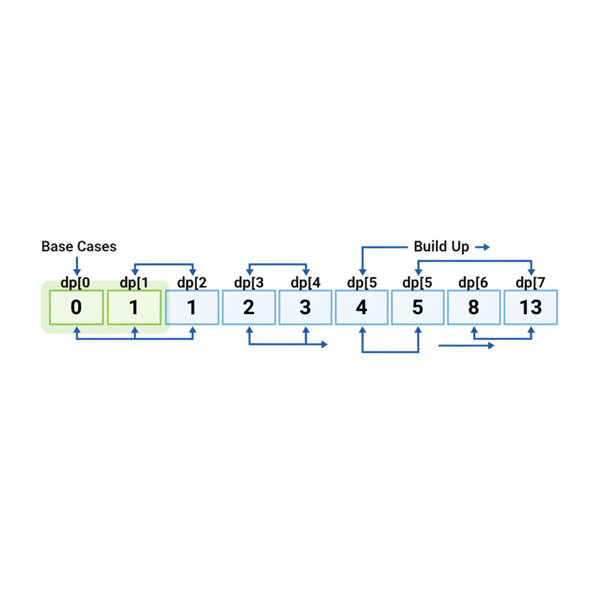
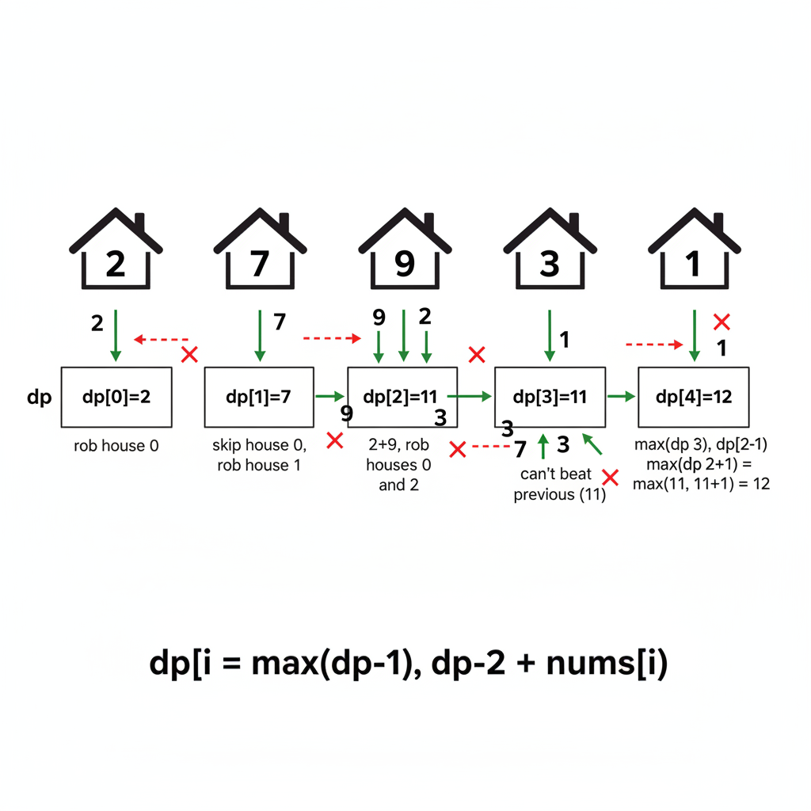
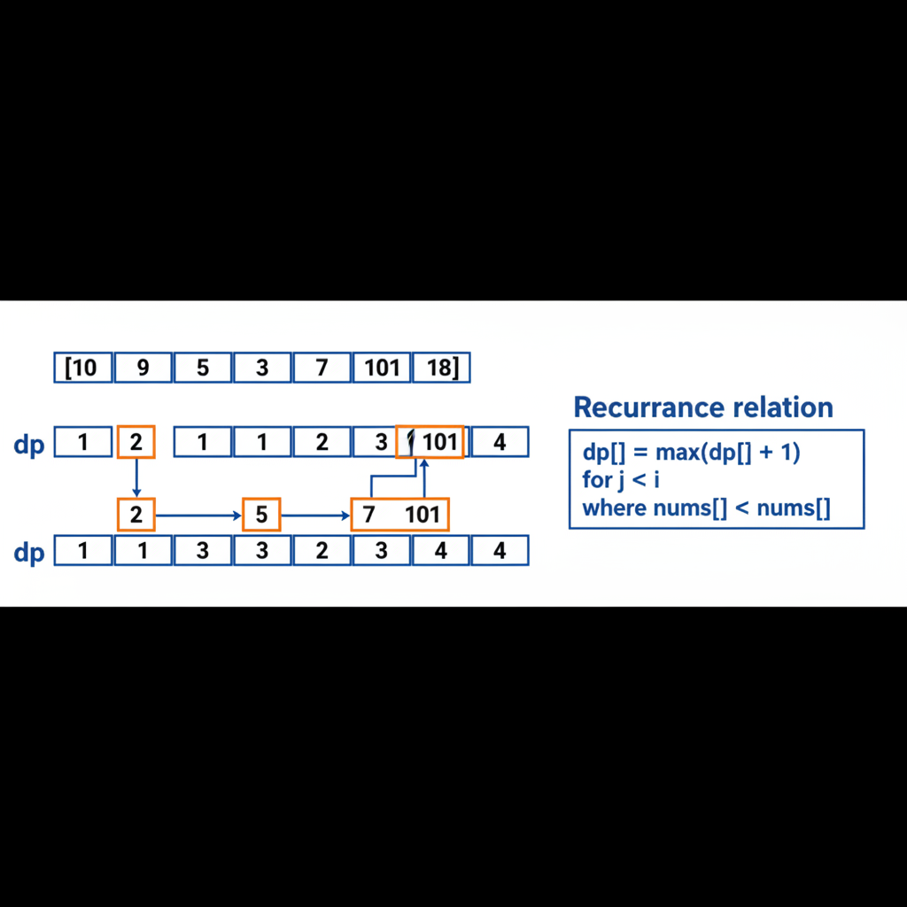

# Dynamic Programming: 1D Problems

Dynamic Programming (DP) is the most feared yet most testable topic in coding interviews. At senior levels, you must recognize DP patterns instantly and implement optimal solutions.



---

## The DP Mindset

DP solves problems by:
1. Breaking them into overlapping subproblems
2. Storing solutions to avoid recomputation
3. Building larger solutions from smaller ones

**Key insight**: If you find yourself computing the same thing multiple times, DP might help.

---

## When to Use DP

Recognize these signals:
- "Find the minimum/maximum..."
- "Count the number of ways..."
- "Is it possible to..."
- "Find the longest/shortest..."
- Optimal substructure: optimal solution contains optimal sub-solutions
- Overlapping subproblems: same subproblems solved repeatedly

---

## The Framework

Every 1D DP problem follows this pattern:

### 1. Define the State
What does `dp[i]` represent?

### 2. Find the Recurrence
How does `dp[i]` relate to previous states?

### 3. Identify Base Cases
What are the starting values?

### 4. Determine Iteration Order
Bottom-up: start from base cases
Top-down: start from target, use memoization

### 5. Optimize Space (if possible)
Often only need last few states

---

## Classic 1D DP Problems

### Fibonacci Numbers

**Problem**: Find the nth Fibonacci number.

**State**: `dp[i]` = ith Fibonacci number

**Recurrence**: `dp[i] = dp[i-1] + dp[i-2]`

**Base cases**: `dp[0] = 0, dp[1] = 1`

```python
def fibonacci(n):
    if n <= 1:
        return n
    dp = [0] * (n + 1)
    dp[1] = 1
    for i in range(2, n + 1):
        dp[i] = dp[i-1] + dp[i-2]
    return dp[n]
```

**Time**: O(n), **Space**: O(n)

**Optimized** (only need last 2 values):
```python
def fibonacci(n):
    if n <= 1:
        return n
    prev2, prev1 = 0, 1
    for _ in range(2, n + 1):
        prev2, prev1 = prev1, prev1 + prev2
    return prev1
```

**Time**: O(n), **Space**: O(1)

---

### Climbing Stairs

**Problem**: You can climb 1 or 2 steps at a time. How many ways to reach step n?

**State**: `dp[i]` = number of ways to reach step i

**Recurrence**: `dp[i] = dp[i-1] + dp[i-2]`
(You can arrive from step i-1 or step i-2)

**Base cases**: `dp[0] = 1, dp[1] = 1`

```python
def climb_stairs(n):
    if n <= 1:
        return 1
    prev2, prev1 = 1, 1
    for _ in range(2, n + 1):
        prev2, prev1 = prev1, prev1 + prev2
    return prev1
```

**Interview tip**: This is literally Fibonacci! Recognizing hidden patterns impresses interviewers.

---

### House Robber

**Problem**: Rob houses along a street. Can't rob adjacent houses. Maximize loot.



**State**: `dp[i]` = max money robbing houses 0 to i

**Recurrence**:
```
dp[i] = max(
    dp[i-1],           # Skip house i
    dp[i-2] + nums[i]  # Rob house i
)
```

**Base cases**: `dp[0] = nums[0], dp[1] = max(nums[0], nums[1])`

```python
def rob(nums):
    if not nums:
        return 0
    if len(nums) == 1:
        return nums[0]

    prev2, prev1 = nums[0], max(nums[0], nums[1])
    for i in range(2, len(nums)):
        prev2, prev1 = prev1, max(prev1, prev2 + nums[i])
    return prev1
```

**Time**: O(n), **Space**: O(1)

---

### Maximum Subarray (Kadane's Algorithm)

**Problem**: Find contiguous subarray with largest sum.

**State**: `dp[i]` = max sum of subarray ending at index i

**Recurrence**: `dp[i] = max(nums[i], dp[i-1] + nums[i])`
(Either start fresh or extend previous)

```python
def max_subarray(nums):
    max_ending_here = max_so_far = nums[0]
    for num in nums[1:]:
        max_ending_here = max(num, max_ending_here + num)
        max_so_far = max(max_so_far, max_ending_here)
    return max_so_far
```

**Time**: O(n), **Space**: O(1)

**Interview tip**: Kadane's is a special DP pattern - instead of storing all states, we track running maximum.

---

### Coin Change (Minimum Coins)

**Problem**: Given coins of different denominations, find minimum coins to make amount.

**State**: `dp[i]` = minimum coins needed to make amount i

**Recurrence**: `dp[i] = min(dp[i - coin] + 1) for all valid coins`

**Base case**: `dp[0] = 0`

```python
def coin_change(coins, amount):
    dp = [float('inf')] * (amount + 1)
    dp[0] = 0

    for i in range(1, amount + 1):
        for coin in coins:
            if coin <= i and dp[i - coin] != float('inf'):
                dp[i] = min(dp[i], dp[i - coin] + 1)

    return dp[amount] if dp[amount] != float('inf') else -1
```

**Time**: O(amount × len(coins)), **Space**: O(amount)

---

### Coin Change 2 (Count Ways)

**Problem**: Count number of ways to make amount using given coins.

**Key difference**: Order doesn't matter (combinations, not permutations)

**State**: `dp[i]` = number of ways to make amount i

```python
def change(amount, coins):
    dp = [0] * (amount + 1)
    dp[0] = 1  # One way to make 0: use no coins

    # Process each coin type separately to avoid counting permutations
    for coin in coins:
        for i in range(coin, amount + 1):
            dp[i] += dp[i - coin]

    return dp[amount]
```

**Interview tip**: Loop order matters! Coin-first gives combinations; amount-first gives permutations.

---

### Word Break

**Problem**: Given string s and dictionary, can s be segmented into dictionary words?

**State**: `dp[i]` = True if s[0:i] can be segmented

**Recurrence**: `dp[i] = any(dp[j] and s[j:i] in wordDict for j in range(i))`

```python
def word_break(s, word_dict):
    word_set = set(word_dict)
    dp = [False] * (len(s) + 1)
    dp[0] = True  # Empty string is valid

    for i in range(1, len(s) + 1):
        for j in range(i):
            if dp[j] and s[j:i] in word_set:
                dp[i] = True
                break

    return dp[len(s)]
```

**Time**: O(n² × k) where k is max word length, **Space**: O(n)

**Optimization**: Use Trie for faster word lookup.

---

### Longest Increasing Subsequence (LIS)

**Problem**: Find length of longest strictly increasing subsequence.



**State**: `dp[i]` = length of LIS ending at index i

**Recurrence**: `dp[i] = max(dp[j] + 1) for all j < i where nums[j] < nums[i]`

```python
def length_of_lis(nums):
    if not nums:
        return 0

    dp = [1] * len(nums)  # Each element is a LIS of length 1

    for i in range(1, len(nums)):
        for j in range(i):
            if nums[j] < nums[i]:
                dp[i] = max(dp[i], dp[j] + 1)

    return max(dp)
```

**Time**: O(n²), **Space**: O(n)

**O(n log n) solution** using binary search:
```python
import bisect

def length_of_lis(nums):
    tails = []  # tails[i] = smallest tail element for LIS of length i+1

    for num in nums:
        pos = bisect.bisect_left(tails, num)
        if pos == len(tails):
            tails.append(num)
        else:
            tails[pos] = num

    return len(tails)
```

---

### Decode Ways

**Problem**: '1' -> 'A', '2' -> 'B', ..., '26' -> 'Z'. Count ways to decode a string.

**State**: `dp[i]` = number of ways to decode s[0:i]

**Recurrence**:
- If s[i-1] is valid (1-9): `dp[i] += dp[i-1]`
- If s[i-2:i] is valid (10-26): `dp[i] += dp[i-2]`

```python
def num_decodings(s):
    if not s or s[0] == '0':
        return 0

    n = len(s)
    dp = [0] * (n + 1)
    dp[0] = 1
    dp[1] = 1

    for i in range(2, n + 1):
        # Single digit
        if s[i-1] != '0':
            dp[i] += dp[i-1]

        # Two digits
        two_digit = int(s[i-2:i])
        if 10 <= two_digit <= 26:
            dp[i] += dp[i-2]

    return dp[n]
```

**Edge cases**: Leading zeros ('0'), consecutive zeros ('00'), invalid sequences.

---

### Jump Game

**Problem**: Can you reach the last index? `nums[i]` = max jump from position i.

**Approach 1**: DP O(n²)
```python
def can_jump(nums):
    n = len(nums)
    dp = [False] * n
    dp[0] = True

    for i in range(1, n):
        for j in range(i):
            if dp[j] and j + nums[j] >= i:
                dp[i] = True
                break

    return dp[n-1]
```

**Approach 2**: Greedy O(n) - track furthest reachable
```python
def can_jump(nums):
    max_reach = 0
    for i, jump in enumerate(nums):
        if i > max_reach:
            return False
        max_reach = max(max_reach, i + jump)
    return True
```

**Interview tip**: Recognize when greedy works and explain why.

---

## DP Optimization Patterns

### Space Optimization

Most 1D DP uses only the previous 1-2 states:

```python
# Before: O(n) space
dp = [0] * n
for i in range(2, n):
    dp[i] = dp[i-1] + dp[i-2]

# After: O(1) space
prev2, prev1 = 0, 1
for _ in range(2, n):
    prev2, prev1 = prev1, prev1 + prev2
```

### Top-Down vs Bottom-Up

**Top-Down (Memoization)**:
- Start from target, recurse down
- Easier to write, matches recurrence directly
- May have recursion overhead

**Bottom-Up (Tabulation)**:
- Start from base cases, build up
- Usually faster (no recursion overhead)
- Easier to optimize space

---

## Common Mistakes

1. **Off-by-one errors**: Carefully define what dp[i] represents
2. **Forgetting base cases**: Especially dp[0]
3. **Wrong iteration order**: Ensure dependencies are computed first
4. **Not handling edge cases**: Empty input, single element
5. **Using wrong data type**: Use float('inf') for minimization problems

---

## Practice Problems (LeetCode)

| Problem | Difficulty | Key Pattern |
|---------|------------|-------------|
| 70. Climbing Stairs | Easy | Fibonacci pattern |
| 198. House Robber | Medium | Skip/take pattern |
| 53. Maximum Subarray | Medium | Kadane's algorithm |
| 322. Coin Change | Medium | Unbounded knapsack |
| 139. Word Break | Medium | Substring DP |
| 300. LIS | Medium | Classic LIS |
| 91. Decode Ways | Medium | Counting paths |
| 55. Jump Game | Medium | Reachability |
| 152. Max Product Subarray | Medium | Track min and max |
| 213. House Robber II | Medium | Circular array |

---

## Key Takeaways

1. **Define the state clearly** - What does dp[i] represent?
2. **Write the recurrence** - How does dp[i] depend on previous states?
3. **Handle base cases** - What are the initial values?
4. **Optimize space** - Usually only need last few states
5. **Practice pattern recognition** - Most problems fall into common categories
