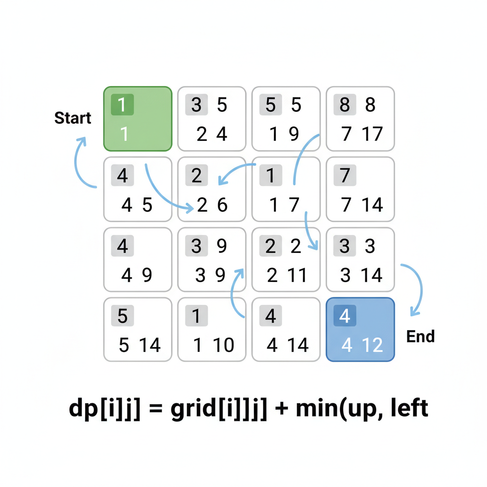
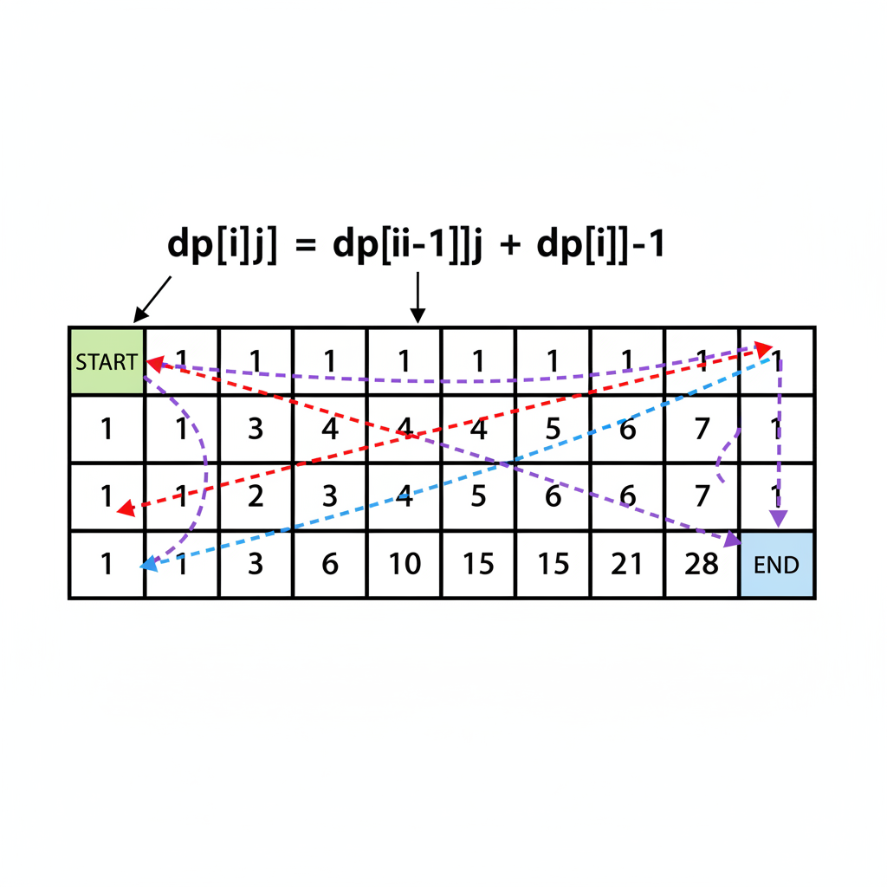
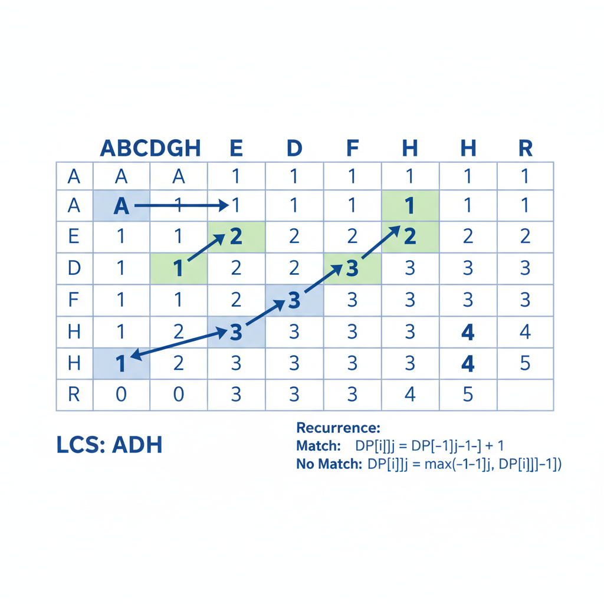
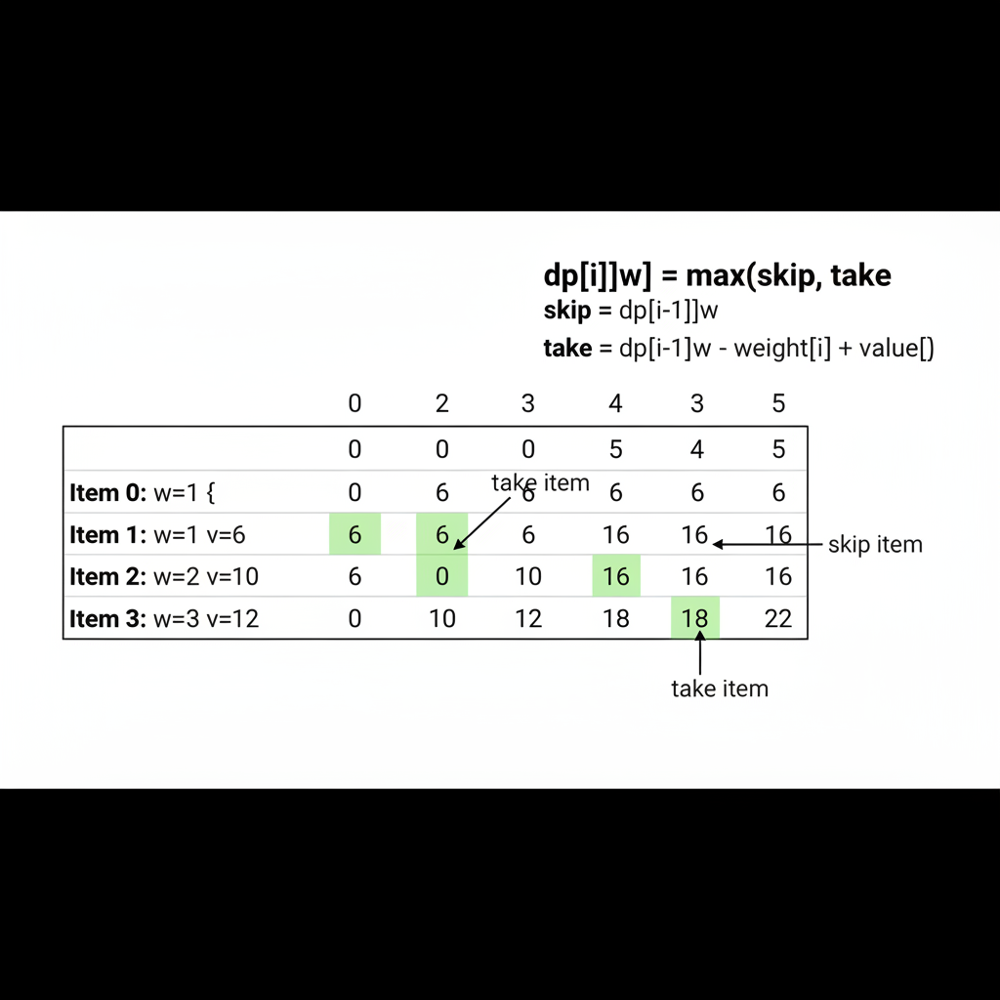

# Dynamic Programming: 2D Problems

2D DP extends the concepts from 1D to problems involving two sequences, grids, or two-dimensional state spaces. These are among the most common interview problems.



---

## Types of 2D DP Problems

1. **Grid Problems**: Paths, minimum cost, obstacles
2. **Two Sequence Problems**: LCS, edit distance, regex matching
3. **Interval DP**: Matrix chain, palindrome partitioning
4. **Knapsack Variants**: 0/1 knapsack, subset sum

---

## The 2D DP Framework

### 1. Define the State
`dp[i][j]` - what does this cell represent?

### 2. Find the Recurrence
How does `dp[i][j]` relate to neighboring cells?

### 3. Identify Base Cases
First row, first column, or diagonal

### 4. Fill Order
Usually row by row, left to right (ensure dependencies are met)

### 5. Space Optimization
Often can reduce from O(n×m) to O(min(n,m))

---

## Grid Problems

### Unique Paths

**Problem**: Find number of paths from top-left to bottom-right (only move right or down).



**State**: `dp[i][j]` = number of ways to reach cell (i, j)

**Recurrence**: `dp[i][j] = dp[i-1][j] + dp[i][j-1]`

**Base case**: First row and first column are all 1s

```python
def unique_paths(m, n):
    dp = [[1] * n for _ in range(m)]

    for i in range(1, m):
        for j in range(1, n):
            dp[i][j] = dp[i-1][j] + dp[i][j-1]

    return dp[m-1][n-1]
```

**Time**: O(m×n), **Space**: O(m×n) → O(n) optimized

**Space-optimized**:
```python
def unique_paths(m, n):
    dp = [1] * n
    for _ in range(1, m):
        for j in range(1, n):
            dp[j] += dp[j-1]
    return dp[n-1]
```

---

### Unique Paths with Obstacles

**Problem**: Same as above, but some cells are blocked.

```python
def unique_paths_with_obstacles(grid):
    m, n = len(grid), len(grid[0])
    if grid[0][0] == 1:
        return 0

    dp = [[0] * n for _ in range(m)]
    dp[0][0] = 1

    # First column
    for i in range(1, m):
        dp[i][0] = 0 if grid[i][0] == 1 else dp[i-1][0]

    # First row
    for j in range(1, n):
        dp[0][j] = 0 if grid[0][j] == 1 else dp[0][j-1]

    # Fill rest
    for i in range(1, m):
        for j in range(1, n):
            if grid[i][j] == 1:
                dp[i][j] = 0
            else:
                dp[i][j] = dp[i-1][j] + dp[i][j-1]

    return dp[m-1][n-1]
```

---

### Minimum Path Sum

**Problem**: Find path from top-left to bottom-right with minimum sum.

**State**: `dp[i][j]` = minimum sum to reach cell (i, j)

**Recurrence**: `dp[i][j] = grid[i][j] + min(dp[i-1][j], dp[i][j-1])`

```python
def min_path_sum(grid):
    m, n = len(grid), len(grid[0])
    dp = [[0] * n for _ in range(m)]
    dp[0][0] = grid[0][0]

    # First column
    for i in range(1, m):
        dp[i][0] = dp[i-1][0] + grid[i][0]

    # First row
    for j in range(1, n):
        dp[0][j] = dp[0][j-1] + grid[0][j]

    # Fill rest
    for i in range(1, m):
        for j in range(1, n):
            dp[i][j] = grid[i][j] + min(dp[i-1][j], dp[i][j-1])

    return dp[m-1][n-1]
```

---

## Two Sequence Problems

### Longest Common Subsequence (LCS)

**Problem**: Find length of longest subsequence present in both strings.



**State**: `dp[i][j]` = LCS length of `text1[0:i]` and `text2[0:j]`

**Recurrence**:
```
if text1[i-1] == text2[j-1]:
    dp[i][j] = dp[i-1][j-1] + 1
else:
    dp[i][j] = max(dp[i-1][j], dp[i][j-1])
```

```python
def longest_common_subsequence(text1, text2):
    m, n = len(text1), len(text2)
    dp = [[0] * (n + 1) for _ in range(m + 1)]

    for i in range(1, m + 1):
        for j in range(1, n + 1):
            if text1[i-1] == text2[j-1]:
                dp[i][j] = dp[i-1][j-1] + 1
            else:
                dp[i][j] = max(dp[i-1][j], dp[i][j-1])

    return dp[m][n]
```

**Time**: O(m×n), **Space**: O(m×n) → O(min(m,n)) optimized

**Reconstructing the LCS**:
```python
def get_lcs(text1, text2):
    # After building dp table...
    lcs = []
    i, j = m, n
    while i > 0 and j > 0:
        if text1[i-1] == text2[j-1]:
            lcs.append(text1[i-1])
            i -= 1
            j -= 1
        elif dp[i-1][j] > dp[i][j-1]:
            i -= 1
        else:
            j -= 1
    return ''.join(reversed(lcs))
```

---

### Edit Distance (Levenshtein Distance)

**Problem**: Minimum operations (insert, delete, replace) to convert word1 to word2.

**State**: `dp[i][j]` = min operations to convert `word1[0:i]` to `word2[0:j]`

**Recurrence**:
```
if word1[i-1] == word2[j-1]:
    dp[i][j] = dp[i-1][j-1]  # No operation needed
else:
    dp[i][j] = 1 + min(
        dp[i-1][j],      # Delete from word1
        dp[i][j-1],      # Insert into word1
        dp[i-1][j-1]     # Replace
    )
```

**Base cases**:
- `dp[i][0] = i` (delete all characters)
- `dp[0][j] = j` (insert all characters)

```python
def min_distance(word1, word2):
    m, n = len(word1), len(word2)
    dp = [[0] * (n + 1) for _ in range(m + 1)]

    # Base cases
    for i in range(m + 1):
        dp[i][0] = i
    for j in range(n + 1):
        dp[0][j] = j

    # Fill table
    for i in range(1, m + 1):
        for j in range(1, n + 1):
            if word1[i-1] == word2[j-1]:
                dp[i][j] = dp[i-1][j-1]
            else:
                dp[i][j] = 1 + min(
                    dp[i-1][j],      # Delete
                    dp[i][j-1],      # Insert
                    dp[i-1][j-1]     # Replace
                )

    return dp[m][n]
```

**Interview tip**: Walk through the recurrence on a whiteboard. Show what each operation means physically.

---

### Longest Palindromic Subsequence

**Problem**: Find length of longest subsequence that is a palindrome.

**Key insight**: LPS(s) = LCS(s, reverse(s))

```python
def longest_palindrome_subseq(s):
    return longest_common_subsequence(s, s[::-1])
```

**Alternative direct DP**:

**State**: `dp[i][j]` = LPS length in `s[i:j+1]`

```python
def longest_palindrome_subseq(s):
    n = len(s)
    dp = [[0] * n for _ in range(n)]

    # Base case: single characters
    for i in range(n):
        dp[i][i] = 1

    # Fill diagonally
    for length in range(2, n + 1):
        for i in range(n - length + 1):
            j = i + length - 1
            if s[i] == s[j]:
                dp[i][j] = dp[i+1][j-1] + 2
            else:
                dp[i][j] = max(dp[i+1][j], dp[i][j-1])

    return dp[0][n-1]
```

---

## Knapsack Problems

### 0/1 Knapsack

**Problem**: Given items with weights and values, maximize value within weight capacity. Each item can be used at most once.



**State**: `dp[i][w]` = max value using items `0..i-1` with capacity `w`

**Recurrence**:
```
if weights[i-1] <= w:
    dp[i][w] = max(
        dp[i-1][w],                           # Don't take item i
        dp[i-1][w - weights[i-1]] + values[i-1]  # Take item i
    )
else:
    dp[i][w] = dp[i-1][w]  # Can't take item i
```

```python
def knapsack(weights, values, capacity):
    n = len(weights)
    dp = [[0] * (capacity + 1) for _ in range(n + 1)]

    for i in range(1, n + 1):
        for w in range(capacity + 1):
            if weights[i-1] <= w:
                dp[i][w] = max(
                    dp[i-1][w],
                    dp[i-1][w - weights[i-1]] + values[i-1]
                )
            else:
                dp[i][w] = dp[i-1][w]

    return dp[n][capacity]
```

**Space-optimized** (1D array, iterate backwards):
```python
def knapsack(weights, values, capacity):
    dp = [0] * (capacity + 1)

    for i in range(len(weights)):
        for w in range(capacity, weights[i] - 1, -1):  # Backwards!
            dp[w] = max(dp[w], dp[w - weights[i]] + values[i])

    return dp[capacity]
```

**Why backwards?** To prevent using the same item multiple times.

---

### Subset Sum

**Problem**: Can we select a subset that sums to target?

**State**: `dp[i][s]` = can we make sum `s` using items `0..i-1`?

```python
def can_partition(nums, target):
    dp = [False] * (target + 1)
    dp[0] = True

    for num in nums:
        for s in range(target, num - 1, -1):
            dp[s] = dp[s] or dp[s - num]

    return dp[target]
```

---

### Partition Equal Subset Sum

**Problem**: Can we partition array into two subsets with equal sum?

```python
def can_partition(nums):
    total = sum(nums)
    if total % 2 != 0:
        return False

    target = total // 2
    dp = [False] * (target + 1)
    dp[0] = True

    for num in nums:
        for s in range(target, num - 1, -1):
            dp[s] = dp[s] or dp[s - num]

    return dp[target]
```

---

## Interval DP

### Matrix Chain Multiplication

**Problem**: Find optimal way to parenthesize matrix multiplication to minimize operations.

**State**: `dp[i][j]` = min operations to multiply matrices `i` through `j`

**Recurrence**:
```
dp[i][j] = min(dp[i][k] + dp[k+1][j] + cost(i,k,j)) for i ≤ k < j
```

```python
def matrix_chain_order(dims):
    n = len(dims) - 1  # Number of matrices
    dp = [[0] * n for _ in range(n)]

    # length = 1: base case (single matrix, 0 operations)

    for length in range(2, n + 1):
        for i in range(n - length + 1):
            j = i + length - 1
            dp[i][j] = float('inf')
            for k in range(i, j):
                cost = dp[i][k] + dp[k+1][j] + dims[i] * dims[k+1] * dims[j+1]
                dp[i][j] = min(dp[i][j], cost)

    return dp[0][n-1]
```

---

### Palindrome Partitioning II

**Problem**: Minimum cuts to partition string into palindromes.

```python
def min_cut(s):
    n = len(s)
    # is_palindrome[i][j] = True if s[i:j+1] is palindrome
    is_palindrome = [[False] * n for _ in range(n)]

    for i in range(n):
        is_palindrome[i][i] = True

    for length in range(2, n + 1):
        for i in range(n - length + 1):
            j = i + length - 1
            if length == 2:
                is_palindrome[i][j] = (s[i] == s[j])
            else:
                is_palindrome[i][j] = (s[i] == s[j]) and is_palindrome[i+1][j-1]

    # dp[i] = min cuts for s[0:i+1]
    dp = list(range(n))  # Worst case: cut after each char

    for i in range(n):
        if is_palindrome[0][i]:
            dp[i] = 0
        else:
            for j in range(i):
                if is_palindrome[j+1][i]:
                    dp[i] = min(dp[i], dp[j] + 1)

    return dp[n-1]
```

---

## Space Optimization Techniques

### Row-by-Row Optimization

When `dp[i][j]` only depends on `dp[i-1][...]`:

```python
# Before: O(m×n) space
dp = [[0] * n for _ in range(m)]
for i in range(1, m):
    for j in range(n):
        dp[i][j] = f(dp[i-1][...])

# After: O(n) space
prev = [0] * n
curr = [0] * n
for i in range(1, m):
    for j in range(n):
        curr[j] = f(prev[...])
    prev, curr = curr, prev
```

### Single Row Optimization

When dependencies allow:
```python
dp = [0] * n
for i in range(1, m):
    for j in range(n):
        dp[j] = f(dp[...])  # Careful with order!
```

---

## Common Patterns Summary

| Problem Type | State Definition | Dependencies |
|--------------|------------------|--------------|
| Grid paths | `dp[i][j]` = ways to reach (i,j) | Up, left |
| LCS | `dp[i][j]` = LCS of prefixes | Diagonal, up, left |
| Edit distance | `dp[i][j]` = min ops for prefixes | Diagonal, up, left |
| Knapsack | `dp[i][w]` = max value with capacity | Previous row |
| Interval | `dp[i][j]` = optimal for range [i,j] | Smaller intervals |

---

## Practice Problems (LeetCode)

| Problem | Difficulty | Pattern |
|---------|------------|---------|
| 62. Unique Paths | Medium | Grid counting |
| 64. Minimum Path Sum | Medium | Grid optimization |
| 1143. LCS | Medium | Two sequences |
| 72. Edit Distance | Medium | Two sequences |
| 516. Longest Palindromic Subsequence | Medium | Interval |
| 416. Partition Equal Subset Sum | Medium | Subset sum |
| 494. Target Sum | Medium | Knapsack variant |
| 97. Interleaving String | Medium | Two sequences |
| 312. Burst Balloons | Hard | Interval DP |
| 115. Distinct Subsequences | Hard | Two sequences |

---

## Key Takeaways

1. **Draw the table** - Visualizing 2D DP makes patterns clearer
2. **Identify dependencies** - What cells does `dp[i][j]` need?
3. **Handle base cases** - First row/column often need special treatment
4. **Optimize space** - Most 2D DP can be reduced to 1D
5. **Practice reconstruction** - Know how to backtrack to find the actual solution
